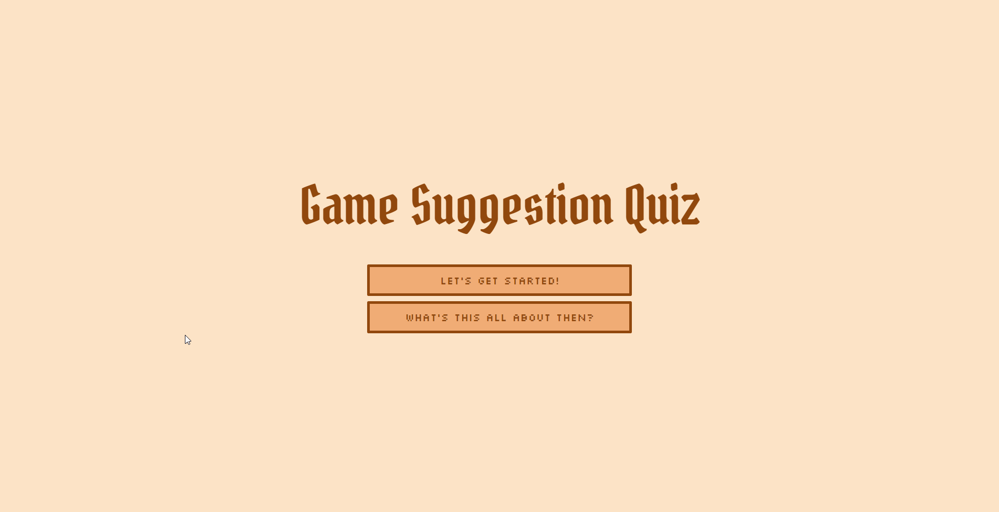
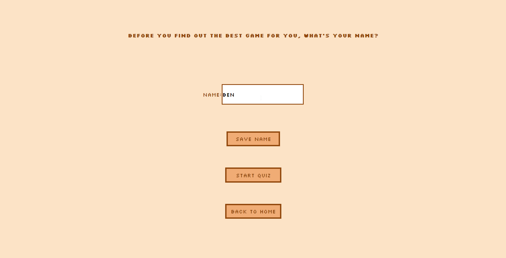
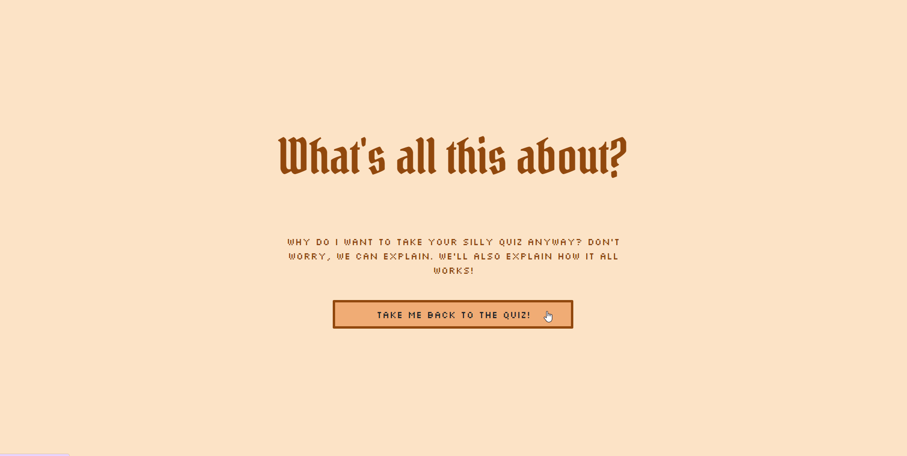

# Game Suggestion Quiz

The motivation behind creating this project was in order to solve a problem which many of us experience, which is indecisiveness, specifically in relation to video games and choosing one to play. With so many fantastic games available to be played nowadays, sometimes it can be overwhelming to try to narrow down your options.

Video games often take many hours to complete and even if some people find them to be very enjoyable, you may feel you wasted a lot of time sinking 20+ hours into a dialogue heavy fantasy rpg, when really you just wanted to be spending your time shooting zombies. Our aim was to create a quiz which acts as a much faster solution of being able to narrow your options down just based on what you are actually looking for.

By taking this quiz and answering these "personality quiz" style questions (except it's about your preferences of what you enjoy in video games) the quiz will match you with the game which scores the highest based on your preferences, so you will be far more likely to enjoy playing the game that we specifically suggest.

The project uses APIs to pull an image of the game artwork, as well as a description of the video game so that the user can get an idea of what the game might be like before they try to play it.

In creating this quiz, we gained a lot of skills in terms of working with JavaScript and utilising multiple APIs to pull data, as well as working both with bootstrap and vanilla HTML and CSS in order to create a visually pleasing and thematically appropriate design.

## Installation

N/A; just open the deployed application link in the browser and you can try the quiz.

## Usage

### Deployed Application

To visit the deployed application, go to the following link:

https://itshazzic.github.io/game-quiz/

### GitHub Repository

To visit the github repository, go to the following link:

https://github.com/itsHazzic/game-quiz

### Presentation

To view the presentation on the project, go to the following link:

https://youtu.be/1kmXQ3gTivg

### How to use the application

Open opening the application, you will be presented with the index (or home) page of the application, as shown:

In order to start the quiz, press the button that says "Let's get started!". This will take you to the page which asks for your name input, and once you have given your name the quiz should begin. However if you press "back to home" this will return you to the homepage.

If you press the "What's this all about then?" button on the home page, it will take you to the about page which shows the user how the quiz works. To return to the home page, press "Take me back to the quiz!"

After answering the questions, the application (using the JavaScript code we have written) will calculate the highest matching quiz based on your preferences. Your game will be suggested to you along with a description of the game and an image, both of which are retrived using an API.

## Credits

Collaborators:

Sarah Marr - https://github.com/itsHazzic
Charlotte Vaughan - https://github.com/PsychicSalad

### APIs used

https://opencritic.com/

https://rawg.io/

### Assets used

https://reffpixels.itch.io/mobile-and-desktop-pixelart-icons

### Tutorials used:

https://www.youtube.com/watch?v=f4fB9Xg2JEY&t=3206s&ab_channel=BrianDesign
https://www.youtube.com/watch?v=MnUd31TvBoU&ab_channel=TheNetNinja
https://www.youtube.com/watch?v=7x2Zk1qwBBU&ab_channel=CodewithAniaKub%C3%B3w
https://www.youtube.com/watch?v=ILupVbhvyNQ&t=77s&ab_channel=GeekProbin

## License

This project uses an MIT license. Please view the license to find out more.
